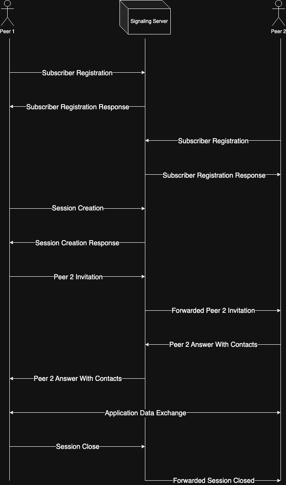

# Signaling Server

Server, used for exchanging contact information between peers. It handles websocket
connections, forwarding such events as:

- Peer registration
- Communication session initialization
- Session invites
- Session termination

## Exchange Mechanism

Before connecting two peers, those two should initially establish websocket connection
with server itself, so in case one peer invites other one, server knows which socket
should be used for forwarding.

Peer, who want to initiate connection, firstly need to create communication session.
It is not limited between only two peers, peers quantity per one session is unlimited.
After session is created, peer is able to invite to this session target peer, via
sending an invitation event to opponent. Opponent itself reviews invite, and if it is
ok for him to connect, he answers positively, providing his own contact details.
After that both of them are eligible for performing ICE procedure.

Additionally, session may be terminated, and such event will be broadcasted to all
participants, so they can do their own finalization procedures.



## Usage

Currently, server may be integrated only as a Spring Boot autoconfiguration.

### Maven Dependency

```xml
<dependency>
    <groupId>com.gastonlagaf.udp</groupId>
    <artifactId>signaling-server</artifactId>
    <version>${LIBRARY_VERSION}</version>
</dependency>
```

### Gradle Dependency

```groovy
implementation "com.gastonlagaf.udp:signaling-server:${LIBRARY_VERSION}"
```

### Configurable properties (**_Currently not configurable, but will be_**)

- **${WS_ENDPOINT:/ws}** - websocket endpoint, available for subscription

### Configurable beans

**_SessionDatastore_** - interface for implementing custom persistence for session objects